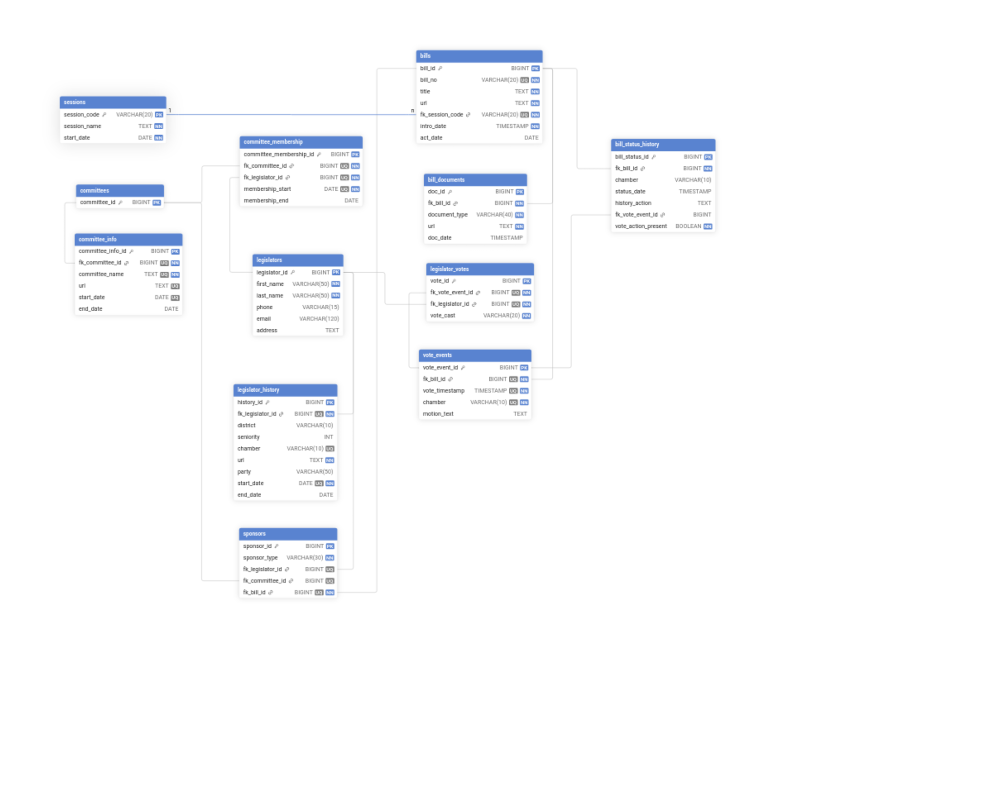

# Web Scraping Pipeline for ark.leg.us

A concurrent, three-stage ETL pipeline to pull, structure,
and index legislative data from the Arkansas State
Legislature.

**This system is engineered to handle several real-world issues:
Thread safety, inconsistent and obscure data, resuming from
crash, and efficient processing.**

## Purpose:

A web-scraping pipeline designed to crawl the ark.leg.us
site for all legislator and bill information available
after 2003. Scraped information is transformed and
normalized to load into a PostgresSQL database for
further analysis.

## Usage:

**Requirements**: Python 3.13, Postgres, Linux

1. Download the repository
2. Run chmod +x \[project_root]/scripts/bootstrap_db.sh
3. Run sudo \[project_root]/scripts/bootstrap.sh
   - Note: requires sudo privelages to create databse users and modify pg_hba.
4. From the project root, run python3 pip install -r requirements.txt
5. Finally, run python3 -m ./src/main

## Tech Stack:
- **Language**: Python 3.13.
  - Concurrency: Native threading and queue.
  - Production Libraries: dotenv, BeautifulSoup4, Requests, psycopg3
  - Development Libraries: Pytest, Ruff, Black, safety, pre-commit
- **Database**: PostgresSQL
  - SCD-2 data storage

## Core Developed Solutions

- A **thread-safe directed graph structure** was created to track
the state of sites scraped, to prevent needing to re-scrape
a site for relevant information.
  - Each node on the state has a data attribute which contains
  the data from its latest pipeline step.
  - The graph has been empowered with methods to save and
  load to and from a json file.
  
- A **registry** was created to centralize the definition of 
pipeline steps and dynamically determine which functions to use.
  - The pipeline takes two keys to determine which function to use,
  an enum which matches the url+path of the page to process,
  and an enum for which pipeline step is being processed.

## Challenges in Development

Getting this system into a state where I felt it was worth
sharing took a bit of iteration and addressing some
architectural and concurrency issues.

### Thread-Safety

Concurrency was implemented not just for performance,
but to demonstrate proficiency in managing shared state
and synchronization primitives, a necessity in 
large-scale ETL systems.

To prevent deadlocks, I implemented Python's synchronization
primitives, threading.rlock, around all shared state (Directed Graph)
modifications. I also utilize Python's built in thread-safe
queue library.

### Dependency-Driven State Resolution

Sometimes a node relies on data from another node before
it can be input into the database. The complication arises
when the dependant node has not yet been processed. This is
solved by creating the necessary node and reputting the 
reliant node until the data it needs is available.

### Inconsistent Data Handling

This system handles messy real-world data (missing fields,
inconsistent entries, dead links) through a few methods:
creating tests for each parser to ensure the data is being 
parsed as expected, and by making use of loggers
at key points of execution to enable debugging data entry,
and graceful shutdown procedures to allow the system
to keep processing what it can, and save/resume from a file.

### Architectural Coupling

The pipeline passes raw python dicts for high flexibility
and extensibility. It manages this trade-off in structure
by enforcing key-match checks inside processing functions
and the loader function is configured with required params
via the registry.

## Architectural Lessions and Future Improvement

- Currently the entire state is kept in memory. The state
can grow to several thousands of nodes, and some nodes
can have large data sets (nodes are slotted, however).
This wasn't a priority because it is manageable by a
competent pc as is and few (<3) nodes will ever have a full
html file saved.
An optimization would be to
use python's shelve so that each node just holds a reference
to its attributes and data.

- The lack of dataclasses throughout pipeline steps, while
intentional in an attempt to increase modularity, was a mistake 
for sacrificing clarity, safety, and fail-fast dynamics.

## View The Scraped Data Here

Once the parser has completed, I intend to publish the
resulting data to Kaggle.

## Application Overview

The application begins by seeding the database with
the 'sessions' table: with legislative session codes
and associated start dates.

Next it performs an operation to filter out the seed_urls
(defined at the top of the file) from the completed seeds (
from a save file).

Then all of the worker threads are created, configured,
and manged by the Orchestrator class using the Registry.

If the crawler is resuming from a previous session (a state
cache file is present), it will resume from where it left off.

If the pipeline encounters an error, the error will be logged
and each thread will begin a graceful shutdown procedure
where it continues processing until depleted.

### Node life-cycle

- A seed node is created and is put on the fetcher (LIFO) queue.
- The fetch queue makes an http request to the node's url
and saves the text to the node.
- The html is parsed for next links using a template from
the registry. These next links are put on the queue.
- If the node needs to be processed and loaded (check registry)
then put it on the next queue, else either mark it completed
or as awaiting children.

- The node is used by the process worker. The html is parsed
for data each data attribute is transformed and normalized.
- The node performs state lookup actions, **if the node
depends on state data that is not present, reput it on the
queue and wait for it to be ready**.
- If the node has its state data, put it into a loader object
and onto the loader queue.

- The node is used by the loader worker. The node's data
is validated against a list of required attributes,
if they are missing the node is marked with state error
and the pipeline continues.
- If the node's data is validated, it undergoes
a final transformation for input into the database (
convert any types to be postgres comptabile)
- The node's data is replaced with the database result
and is marked as completed or awaiting children.

- Once all nodes are processed (marked completed or
awaiting children), a check passes and the seed url and
all related nodes are removed from the graph, and a new
seed url is passed.